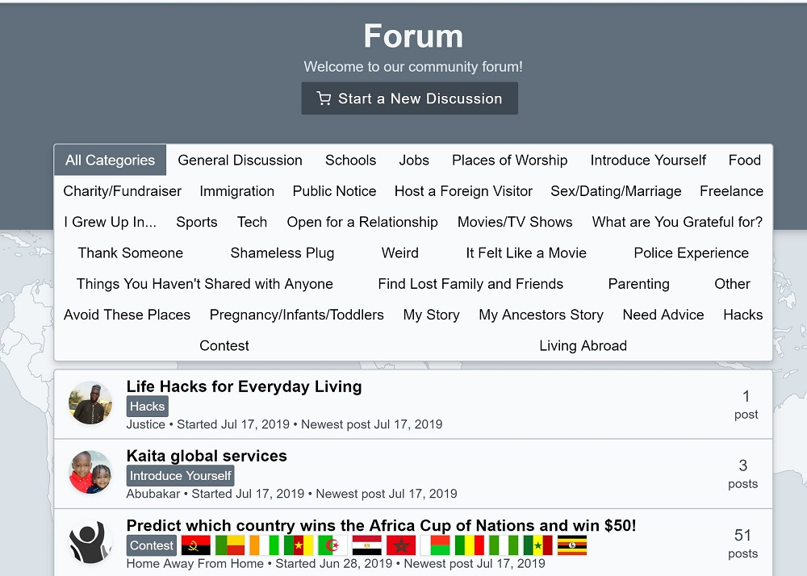

## Overview

From an idea to an average of 1,000 page views per day and than 500 registered users across the world since June 2019. I started Home Away From Home to help people like me live abroad with success and also connect natives to non-natives. I handle static pages, user experience and head the marketing team.

View live: [click here](https://homeawayfromhome.online/ "Home Away From Home").

## Tech Stack

- PostgreSQL Database
- Caddy HTTP Server - Handles HTTPS automatically
- Hapi.js API Server - Manages data requests
- Local authentication
- Google authentication
- Facebook authentication
- Hyperapp - Lightweight Javascript framework. < 2KB download size.
- Tailwind - CSS Utility library.

## Screenshots

