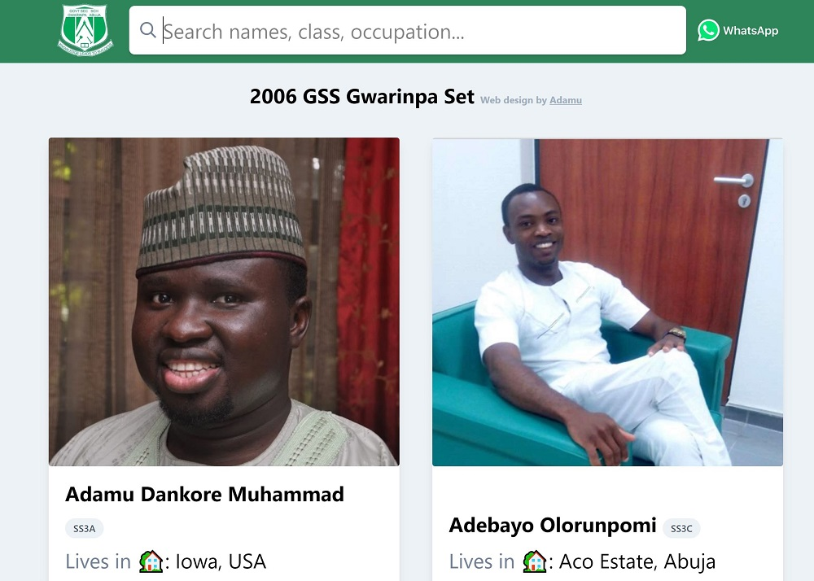
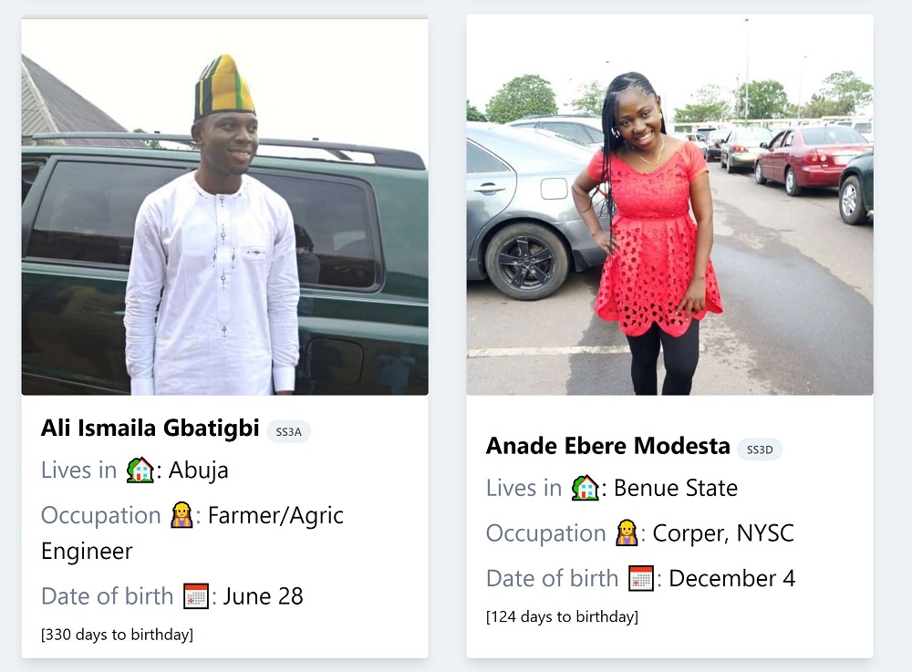
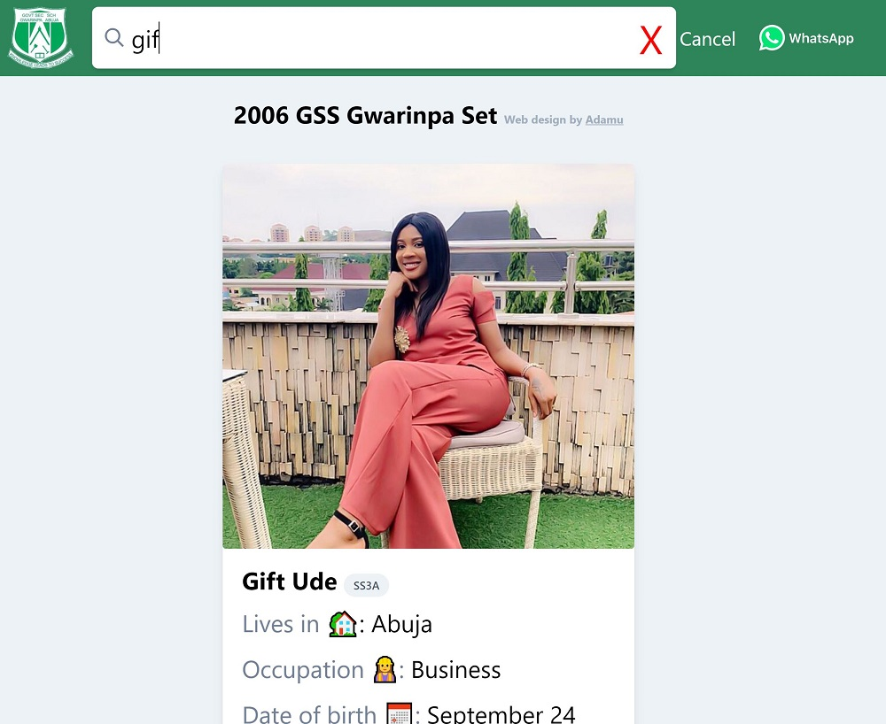

## Overview

I put together all the information my former classmates had in PDF format and turned it into a website. I stored the information as a JSON file and retrieve it via AJAX request from the Github server. Included error handling and search functionality.

See site live: [click here](https://gosan06.netlify.com/ "Live Preview").

See repo: [click here](https://github.com/dankore/gss-gwarinpa-2006-set "GitHub Repo").

See original PDF: [Click here](https://1drv.ms/b/s!AuOdQ10mJ7QNhM0yuTVCjtjSiwEVDg?e=mg3Tix "PDF").

## Tech stack

- JavaScript
- Handlebars.js - A JavaScript templating library
- Tailwindcss - A CSS utility library
- HTML5

## Screenshots

