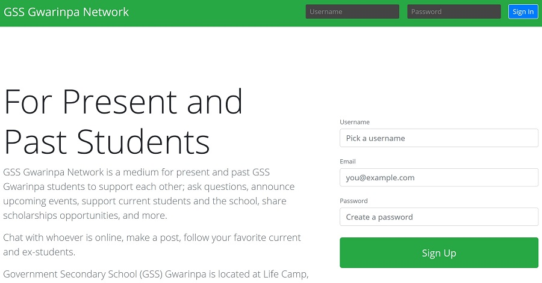
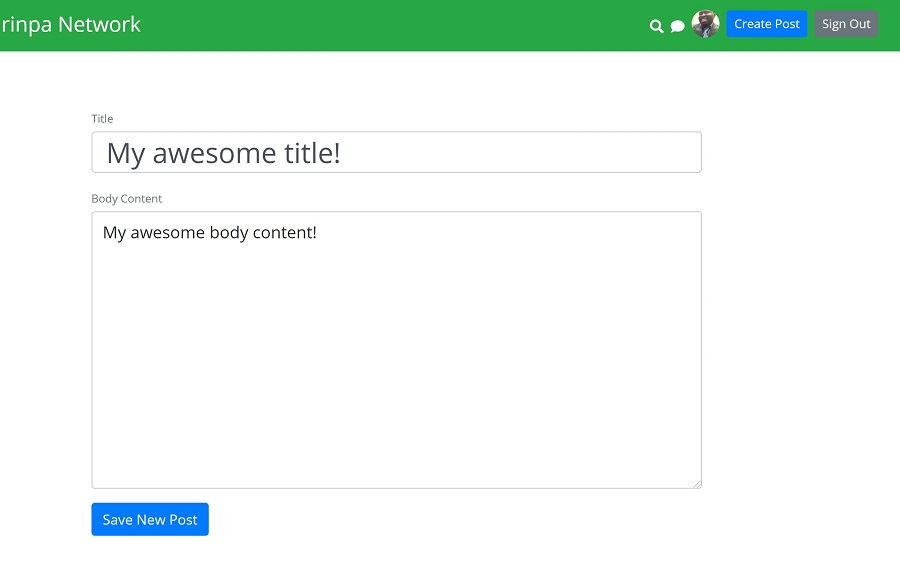
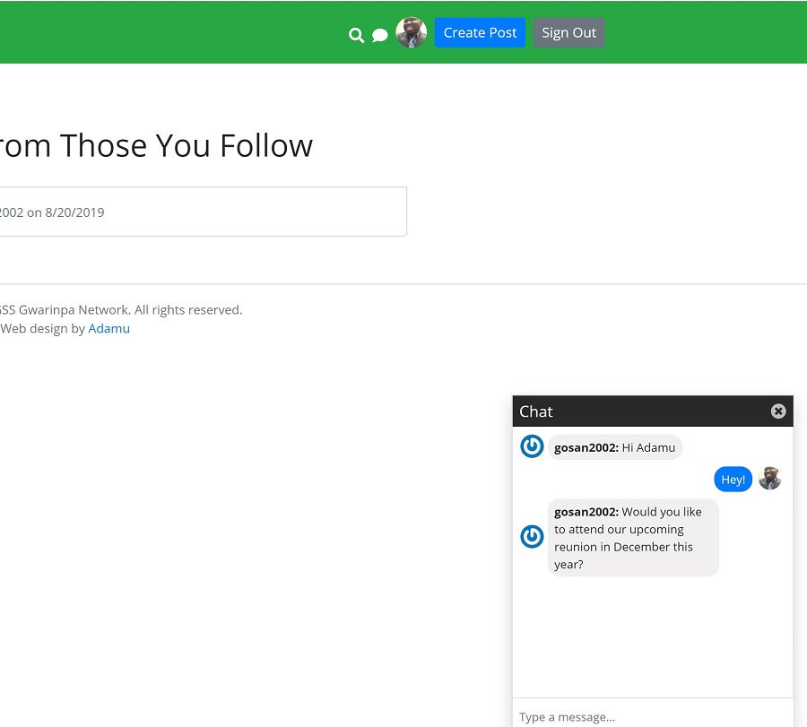

## Overview

Unlike [the alumni website I created for GSS Gwarinpa class of 2006](https://gosan06.netlify.com/), GSS Gwarinpa Network is a web application for both present and past GSS Gwarinpa students to network. GSS Gwarinpa is my alma mater located in Abuja, Nigeria. Some of the features of the app include the ability of users to follow or unfollow other users, creating, editing, and deleting a post, curated lists of posts, and more. 

## Tech stack

- JavaScript
- Nodejs
- Express
- MongoDB Atlas
- Authentication
- HTLM5
- Boostrap4
- MVC architecture

See site live: [click here](http://www.gssgwarinpa.com).
See GitHub repo: [click here](https://github.com/dankore/social-app).

## Screenshots

