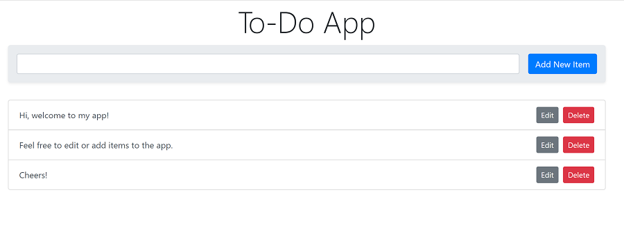

## Overview

A basic to do app that performs CRUD operations to a backend MongoDB database using Nodejs.

#### You require the following username and password to access the app

Username: ```abuja```
Password: ```nigeria```

See the site live: [click here](https://crud-todo-app.herokuapp.com/ " CRUD Todo App").

## Tech Stack

- JavaScript
- Nodejs
- Express
- MongoDB Cloud
- Authentication
- HTLM5
- Boostrap4

## Screenshots



