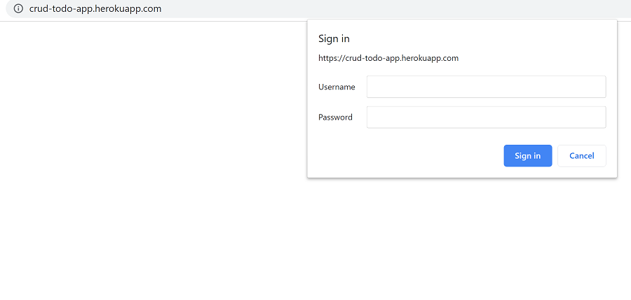

## Overview

Todo App is part of Wes Bos' JavaScript30 course about storing information on the browser (local storage). I customized the course to include featues like deleting all or selected items on the list.

See the site live: [click here](https://localstorage-in-todolist.netlify.com "Todo App").

## Tech Stack

- JavaScript
- HTLM5
- CSS3

## Screenshots

